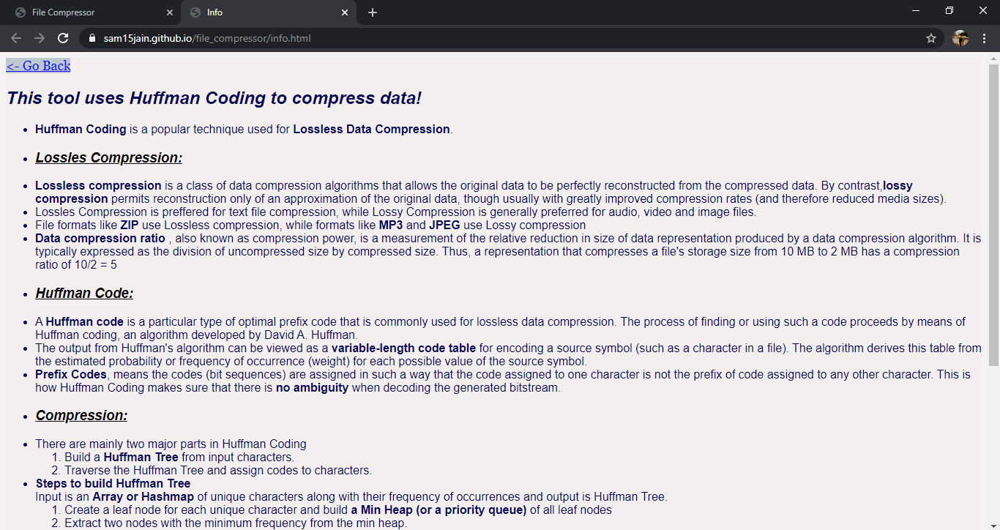
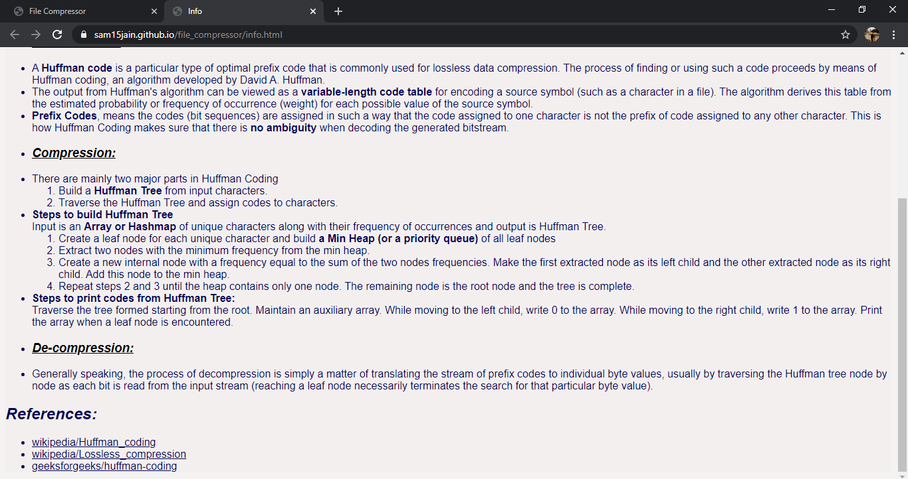

<!-- Author : Atul Pandey   -->

# Text File Compressor Web App

* Uses Huffman Coding for Text Compression
* Made with JAVASCRIPT , HTML and CSS
* Website Link : https://pandeyp9.github.io/File-compressor/

## About

* Performs Lossless compression and decompression of .txt files using Huffman Coding technique .
* Each character is assigned a unique variable length binary code, instead of its 8-bit representation, with more frequent characters having smaller codes. A Huffman Tree is created and stored to generate and decode these codes.
* Compression ratio usually improves as the file size increases.
* The website is made responsive (with HTML and CSS ) and interactive (with JavaScript ) .
* An Info page is added to give more information about Huffman coding.

* Website is Responsive

* Link at the bottom of the page links to an Info page that provides more information about Huffman Coding

